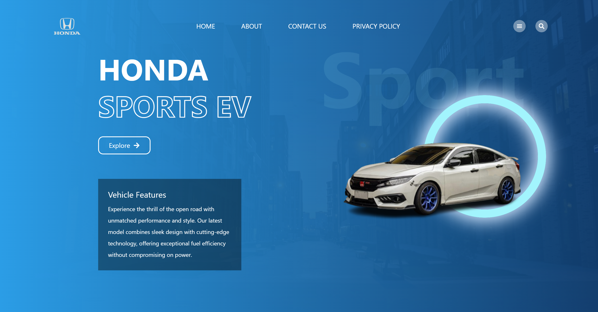
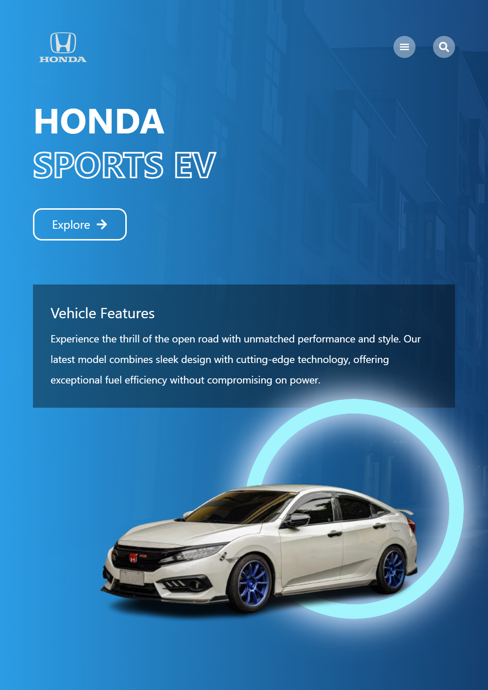

# 🏍️ Honda Website

A modern, responsive clone of the Honda official website built using **React**, **Tailwind CSS**, and **Framer Motion**. This website reflects the sleek and innovative design style of Honda’s brand, optimized for performance and visual appeal.

---

## 🚀 Live Demo

🔗 [Click here to visit the live site](https://honda-sports.netlify.app)

---

## 📸 Preview

Here are a few screenshots of the website:

- 

- 

---

## 🧰 Tech Stack

- ⚛️ React.js
- 🎨 Tailwind CSS
- 🎞️ Framer Motion
- 🌐 Hosted on Netlify

---

## 🎯 Features

- Responsive and clean UI
- Smooth scroll and animations using Framer Motion
- Sticky navbar and interactive sections
- Optimized images and performance

---

# 🛠️ Getting Started

To run this project locally:

## Clone the repo

git clone https://github.com/AsadKhan-11/honda-site.git

## Go into the project directory

cd honda-site

## Install dependencies

npm install

## Start the local dev server

npm run dev
